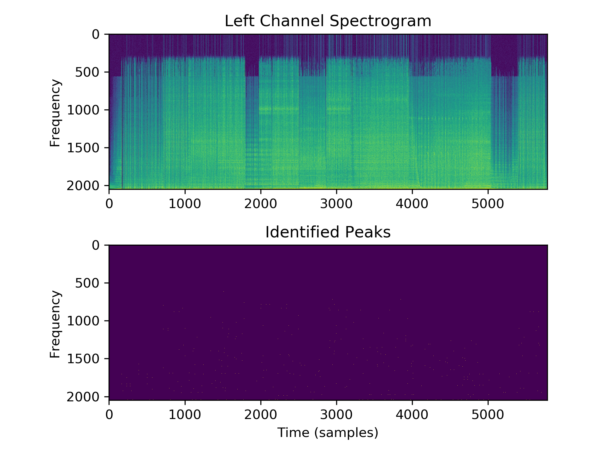

# ZWAZAM: A less cool implementation of Shazam in Python
**THIS PROJECT IS STILL UNDER CONSTRUCTION**

This repo attempts to recreate the methodologies of Shazam using only Python
libraries and some SQL. The main idea is to use the spectrogram (frequency, time vs relative strength in a 2D matrix)
to find spectral peaks. These spectral peaks come in unique patterns for every
song; so if we can identify the peaks relative placement with one another,
that should act like a fingerprint for the song. After finding these peaks,
hashes are constructed to tell us how those peaks are distributed and those
hashes are stored in a database with metadata about the song. When an unknown bit
of song is fingerprinted, we can look up what song shares the most
similarities with the new bit and identify the unknown song.

An example of the spectrogram and associated peaks can be seen here:

## Requirements

* Python3 and a package manager (pip shown here, but conda will work)
* `pip install scipy matplotlib numpy flask psycopg2 pyaudio requests`
* Install Postgres SQL and init a database

## Usage

#### Proof of Concept from WAV

1. Start PSQL
2. `bash database_management_scripts/setup_psql.sh`
3. `python fingerprint_directory_of_files.py test_wav`
4. `python match_song test_wav/samples_for_test/Bust_This_subsection.wav`

Output:
> Bust_This_Bust_That.wav

Match Counts (not shown currently):
>(DEBUG ONLY) {'I_Want_To_Destroy_Something_Beautiful.wav': 11, 
'Bust_This_Bust_That.wav': 53, 'jazz_club.wav': 6, 
'Sonic_Marble_Zone.wav': 4, 'SMB_Overworld.wav': 4})

#### Proof of Concept from Microphone

See video here: https://youtu.be/YW9NZtL9Xi4

#### Using the API 

See README.md in [flask_api](flask_api)
